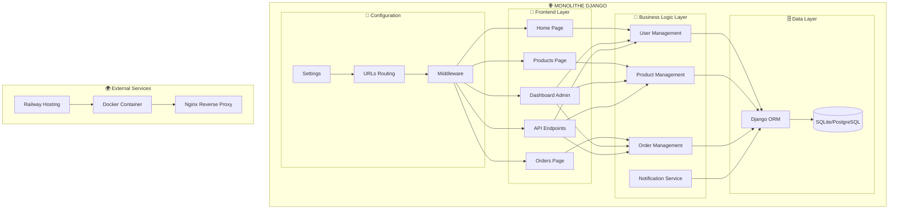
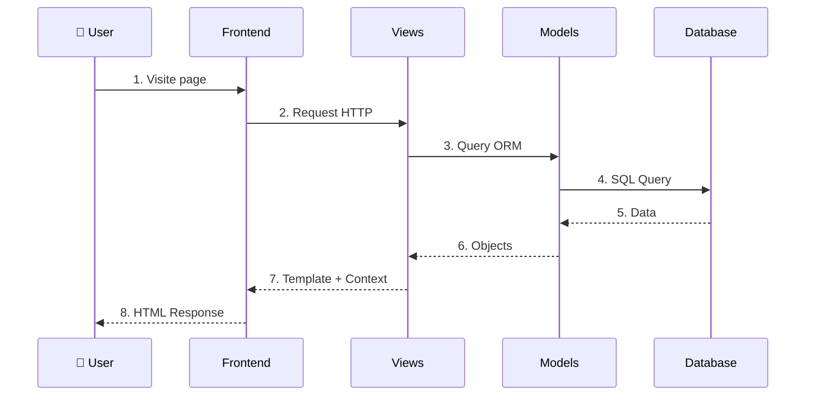
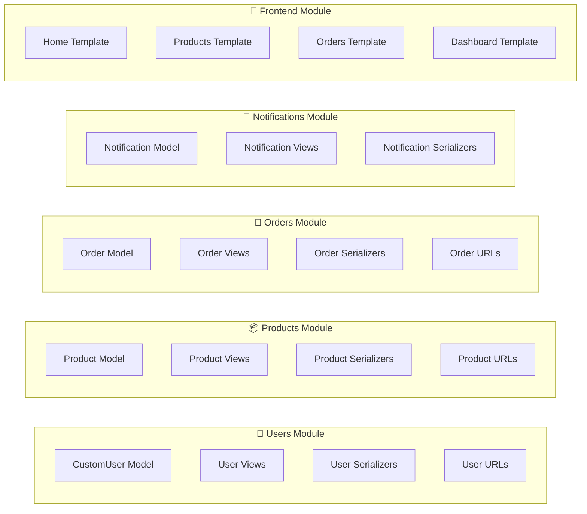
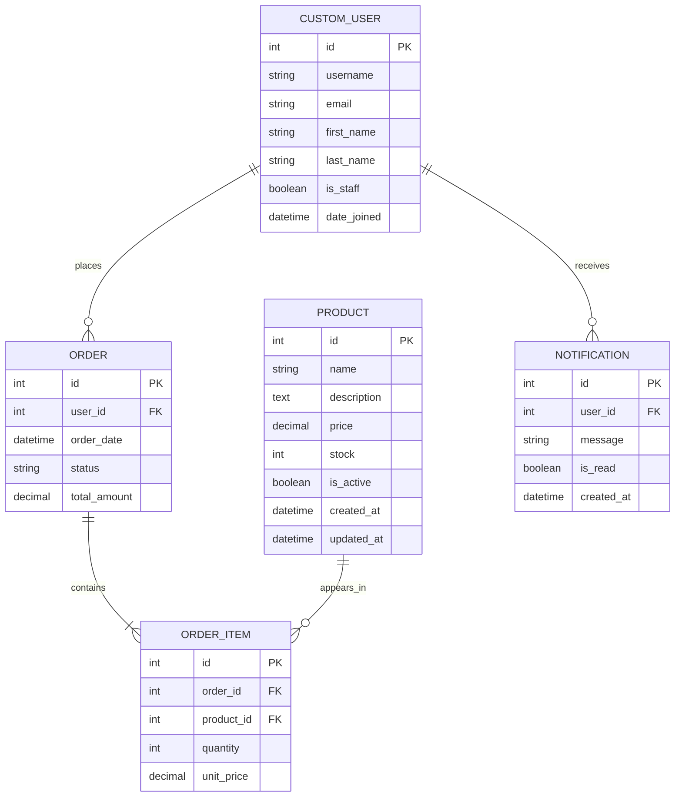
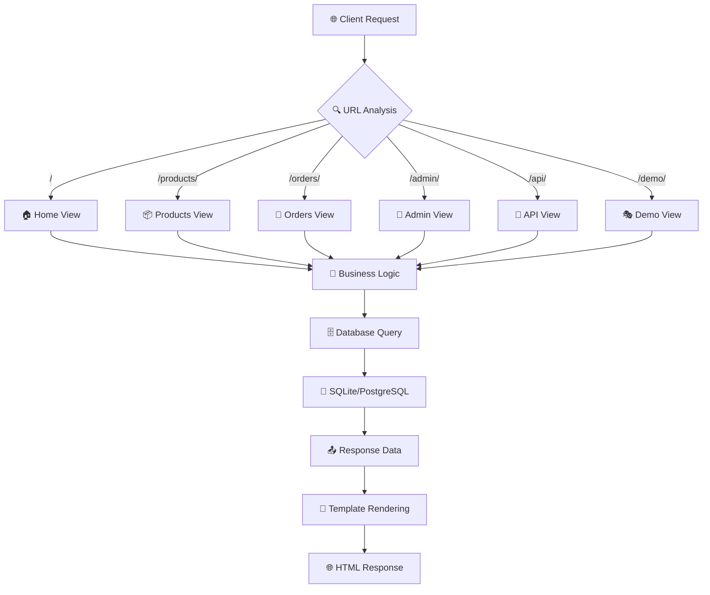
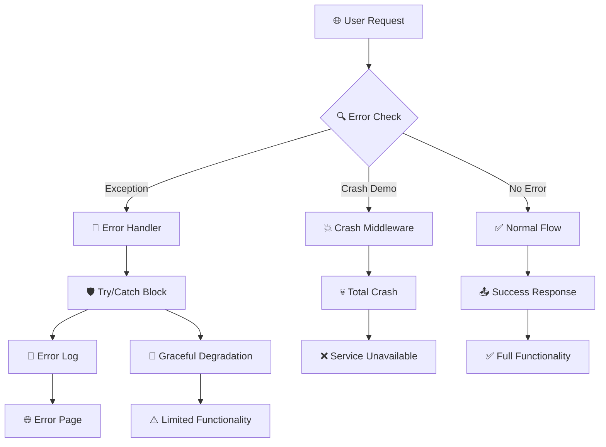
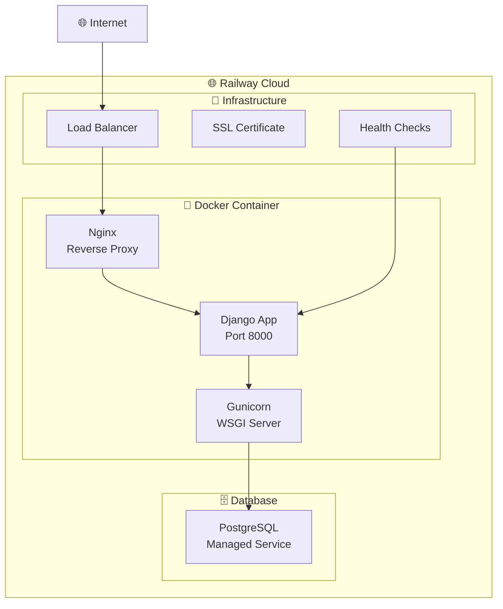
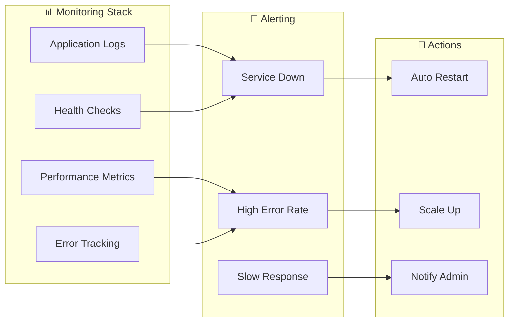

# 🏗️ SCHÉMA ARCHITECTURAL - MONOLITHE E-COMMERCE

## 📋 VUE D'ENSEMBLE



## 🎯 FONCTIONNEMENT INTERNE

### 📊 Flux de Données



## 🏛️ STRUCTURE DES MODULES

### 📦 Détail par Module



## 🔄 INTERCONNEXION DES SERVICES

### 🌐 Points d'Entrée Uniques

```mermaid
graph TD
    subgraph "🚀 Single Entry Point"
        A[Django Runserver<br/>Port 8000]
    end
    
    subgraph "📡 URL Dispatcher"
        B[/ → Home]
        C[/products/ → Products]
        D[/orders/ → Orders]
        E[/admin/ → Admin]
        F[/api/ → REST API]
    end
    
    subgraph "🎭 Demo Endpoints"
        G[/demo/crash-total/ → Crash]
        H[/demo/resilient/ → Tolérance]
    end
    
    A --> B
    A --> C
    A --> D
    A --> E
    A --> F
    A --> G
    A --> H
```

## 🗄️ ARCHITECTURE DE DONNÉES

### 📊 Tables Unifiées



## 🔄 CYCLE DE VIE D'UNE REQUÊTE

### 📡 Processus Complet



## 🚨 GESTION DES ERREURS

### 🛡️ Points de Défaillance



## 🌍 DÉPLOIEMENT PRODUCTION

### 🐳 Architecture Docker



## 📊 MONITORING ET OBSERVABILITÉ

### 🔍 Points de Surveillance



## 🎯 AVANTAGES ARCHITECTURAUX

### ✅ Forces du Monolithique

1. **🚀 Déploiement Unifié**
   - Un seul conteneur Docker
   - Une seule base de code
   - Un seul processus à monitorer

2. **⚡ Performance Optimale**
   - Pas de latence réseau
   - Transactions atomiques
   - Partage de mémoire efficace

3. **🔧 Debugging Simplifié**
   - Stack trace complète
   - Un seul processus à analyser
   - Logs centralisés

4. **💾 Cohérence des Données**
   - Une seule base de données
   - Transactions ACID garanties
   - Pas de sync complexes

### ❌ Faiblesses du Monolithique

1. **💥 Point de Défaillance Unique**
   - Un bug = toute l'application down
   - Difficile d'isoler les problèmes
   - Impact maximal des erreurs

2. **📈 Scaling Complexe**
   - Tout doit scaler ensemble
   - Pas de scaling granulaire
   - Coûts optimisation difficiles

3. **🔄 Déploiements Globaux**
   - Impossible de déployer qu'une partie
   - Temps de déploiement longs
   - Risques élevés par changement

---

## 🎓 CONCLUSION PÉDAGOGIQUE

### 🎯 Messages Clés pour la Présentation

1. **"Le monolithe = simplicité architecturale"**
   - Tout est dans un seul projet
   - Facile à comprendre et développer
   - Déploiement simple

2. **"Mais cette simplicité a un prix : la fragilité"**
   - Un point de défaillance unique
   - Impact global des erreurs
   - Difficile à faire évoluer

3. **"La solution : monitoring et gestion d'erreurs"**
   - Détection rapide des problèmes
   - Isolation des erreurs critiques
   - Dégradation gracieuse

4. **"L'alternative : les microservices"**
   - Indépendance des services
   - Isolation des pannes
   - Complexité opérationnelle

---

**🏗️ Ce schéma montre comment tous les services sont liés dans notre monolithe !**
